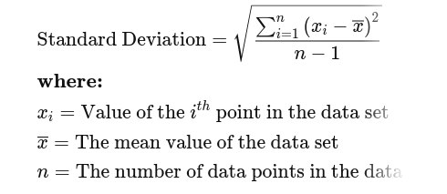
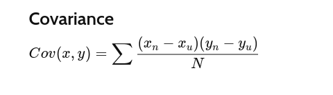
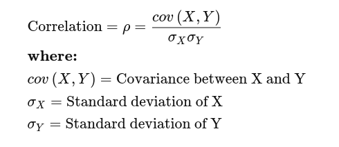

## Linear Regression:
    1. Linear regression attempts to model the relationship between two variables by fitting a linear equation to observed data. 

    Y = a + bX, where X is the independent variable and Y is the dependent variable. The slope of the line is b, and a is the intercept (the value of y when x = 0).
    
    2. One variable is considered to be an independent variable, and the other is considered to be a dependent variable.

    3. Linear Regression can be used when the target variable is numerical and continuous.

    3. Before attempting to fit a linear model to observed data, a modeler should first determine whether or not there is a relationship between the variables of interest. This does not necessarily imply that one variable causes the other (for example, higher SAT scores do not cause higher college grades), but that there is some significant association between the two variables. A scatterplot can be a helpful tool in determining the strength of the relationship between two variables. If there appears to be no association between the proposed explanatory and dependent variables (i.e., the scatterplot does not indicate any increasing or decreasing trends), then fitting a linear regression model to the data probably will not provide a useful model. A valuable numerical measure of association between two variables is the **correlation coefficient**, which is a value between -1 and 1 indicating the strength of the association of the observed data for the two variables

__What Is Standard Deviation?__

Standard deviation is a statistic that measures the dispersion of a dataset relative to its **mean** and is calculated as the **square root of the variance**. The standard deviation is calculated as the square root of variance by determining each data point's deviation relative to the mean.

If the data points are further from the mean, there is a higher deviation within the data set; thus, the more spread out the data, the higher the standard deviation.

__What is Covariance?__

A statistical measure of the **directional relationship** between two variables. positive covariance means the two variables tend to move together. When one variable has a positive value, the other tends to have a positive value as well. If the result were negative, then the two variables would tend to have opposite values.

Finding that two variables have a high or low covariance might not be a useful metric on its own. Covariance can tell how the variables move together, but to determine the strength of the relationship, we need to look at their **correlation**. The correlation should, therefore, be used in conjunction with the covariance, and is represented by this equation:

The equation above reveals that the correlation between two variables is the covariance between both variables divided by the product of the standard deviation of the variables. While both measures reveal whether two variables are positively or inversely related, the correlation provides additional information by determining the degree to which both variables move together. The correlation will always have a measurement value between -1 and 1, and it adds a strength value on how the variables move together.

If the correlation is 1, they move perfectly together, and if the correlation is -1, the variables move perfectly in opposite directions. If the correlation is 0, then the two variables move in random directions from each other. In short, covariance tells you that two variables change the same way while correlation reveals how a change in one variable affects a change in the other. 

## References

    1. https://www.investopedia.com/articles/financial-theory/11/calculating-covariance.asp
    2. https://www.investopedia.com/terms/s/standarddeviation.asp
    3. https://www.mathsisfun.com/data/least-squares-regression.html
    4. https://ruder.io/optimizing-gradient-descent/
    5. https://www.kaggle.com/code/ryanluoli2/a-complete-guide-to-linear-regression/notebook
